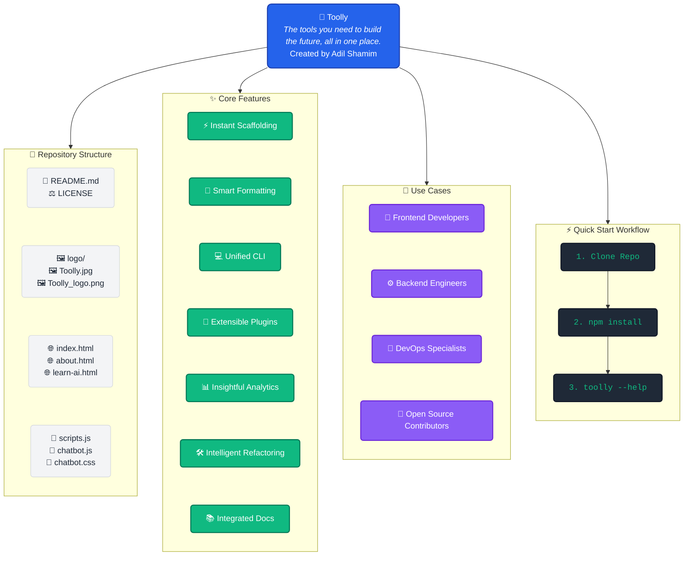

<div align="center">
  
  
  <p><strong><em>The tools you need to build the future, all in one place.</em></strong></p>

  <p>
    <a href="https://opensource.org/licenses/MIT"></a>
    <a href="https://github.com/AdilShamim8/Toolly/issues"></a>
    <a href="https://github.com/AdilShamim8/Toolly/stargazers"></a>
    <a href="http://www.toolly.tech/"></a>
  </p>
</div>

Welcome to **Toolly**, crafted with purpose and simplicity to empower every developer's journey. Here, we don't just provide utilities—we spark creativity, ignite innovation, and remove barriers between your ideas and reality.

<details>
<summary><strong> Table of Contents</strong></summary>

- [Project Overview](#-project-overview)
- [Vision & Philosophy](#-vision--philosophy)
- [What Makes Toolly Special](#-what-makes-toolly-special)
- [Core Features](#-core-features)
- [Quick Start](#-quick-start)
- [Use Cases](#-use-cases)
- [Contributing](#-contributing)
- [License](#-license)

</details>

---

##  Project Overview



##  Vision & Philosophy

> *"Innovation distinguishes between a leader and a follower."*

In the spirit of relentless innovation, Toolly was born from a belief: that the right tool, at the right time, can change everything. We imagine a world where developers focus on solving problems, not wrestling with setup. Toolly is that world made real.

We believe leadership in software comes from clarity of purpose. Every line in Toolly is intentional, and every feature is designed to empower. Our tools don't just solve problems—they transform how you think about solving them.

##  What Makes Toolly Special

* **Elegant Simplicity:** A curated suite of utilities, each refined to do exactly what you need—no clutter, no confusion.
* **Seamless Integration:** Designed to plug into your existing workflow; whether you're scripting, prototyping, or deploying, Toolly is there.
* **Open by Design:** Every component is open source. Your feedback shapes the next release, and your contributions power the community.
* **Developer-First Approach:** Built by developers, for developers—with the intuitive interfaces and powerful capabilities you actually need.
* **Cross-Platform:** Works flawlessly across Windows, macOS, and Linux environments.

##  Core Features

1. **Instant Scaffolding:** Bootstrap any project with a single command.
2. **Smart Formatting:** Keep your code clean and consistent—automatically.
3. **Unified CLI:** One interface to rule them all; no more context switching.
4. **Extensible Plugins:** Build or install plugins that speak your language.
5. **Insightful Analytics:** Track your workflow, then optimize with real data.
6. **Intelligent Refactoring:** Transform your codebase with confidence through automated refactoring tools.
7. **Integrated Documentation:** Generate comprehensive docs directly from your code comments.

##  Quick Start

Get up and running with Toolly in seconds.

**1. Clone the repository**

```bash
git clone https://github.com/AdilShamim8/Toolly.git
cd Toolly

```

**2. Install dependencies**

```bash
npm install    # or yarn install

```

**3. Run the CLI**

```bash
toolly --help  # see available commands

```

*That's it. You're ready to unlock your potential.*

##  Use Cases

| Role | How Toolly Helps |
| --- | --- |
|  **Frontend Developers** | Rapidly prototype UI components, optimize assets, and validate markup. |
|  **Backend Engineers** | Test APIs, manage database migrations, and monitor performance. |
|  **DevOps Specialists** | Streamline deployment workflows, automate testing, and ensure consistency across environments. |
|  **Open Source Contributors** | Standardize code style, generate changelogs, and simplify release management. |

##  Contributing

Your ideas fuel this project! Whether you find a bug, dream up a new feature, or want to improve the documentation, we welcome your contributions:

1. **Fork** the repository.
2. **Create** a feature branch (`git checkout -b feature/AmazingFeature`).
3. **Commit** your changes (`git commit -m 'Add some AmazingFeature'`).
4. **Push** to the branch (`git push origin feature/AmazingFeature`).
5. **Open** a Pull Request.

Let's build the future—together.

##  License
Released under the **MIT License**. See the [LICENSE](https://www.google.com/search?q=./LICENSE) file for details.

<div align="center">
<i>Designed and built with by <a href="https://adilshamim.me/">Adil Shamim</a></i>

<a href="http://www.toolly.tech/"><strong>Visit Toolly</strong></a>
</div>
